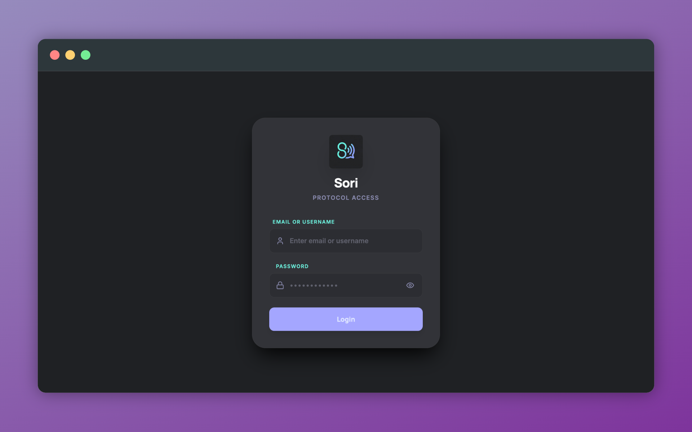
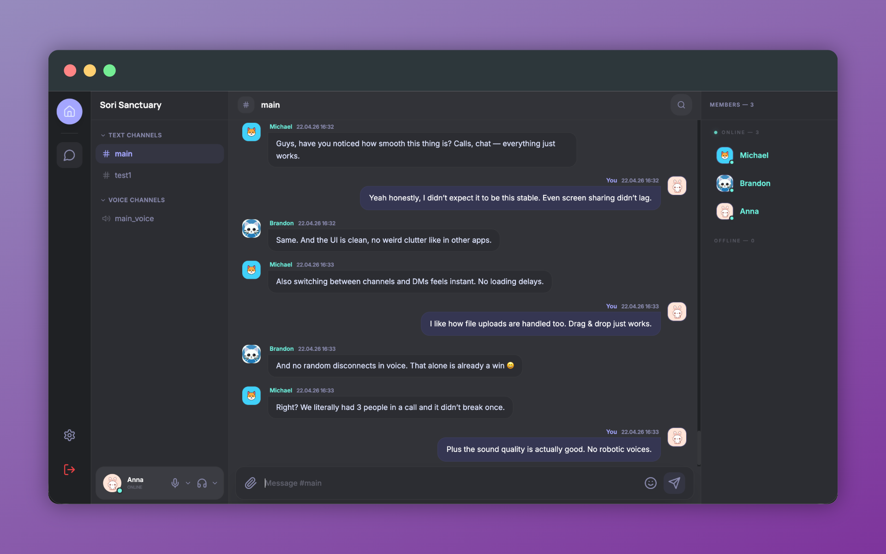
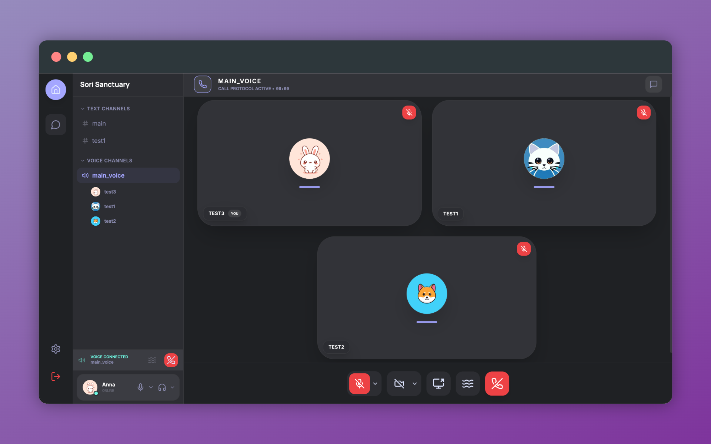
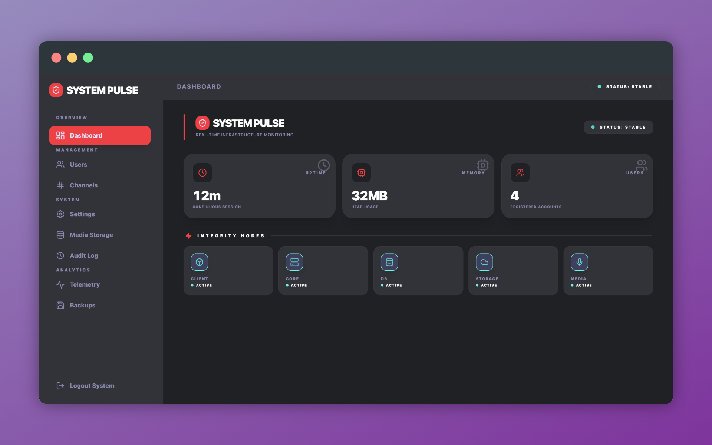

<p align="center">
  
</p>

<h1 align="center">Sori</h1>

<p align="center">
  <b>Self-hosted communication platform you actually control.</b><br/>
  Chat • Voice • Calls • Media • Admin — in one system
</p>

<p align="center">
  🇬🇧 English | <a href="./README.md">🇷🇺 Русский</a>
</p>

---

## ✨ What is SORI

SORI is a self-hosted communication platform that brings messaging, voice, calls, media, and administration into a single unified system.

It is designed to replace fragmented tools with one controlled environment:

💬 real-time messaging  
🔊 voice channels  
📞 direct and group calls  
📎 file and media sharing  
🛠 built-in admin panel  

No external services. No vendor lock-in.  
Just your infrastructure, fully under your control.

---

## 📸 Preview

<p align="center">
  
  <br/>
  <i>Login</i>
</p>

<p align="center">
  
  <br/>
  <i>Chat</i>
</p>

<p align="center">
  
  <br/>
  <i>Calls</i>
</p>

<p align="center">
  
  <br/>
  <i>Admin</i>
</p>

---

## ⚡ Features

- Real-time chat — fast messaging, reactions, live updates  
- Voice & calls — powered by LiveKit for low-latency communication  
- Media uploads — S3-compatible storage via MinIO  
- Channels & direct messages — structured communication model  
- Admin panel — manage users, channels, storage, and system state  
- Self-hosted — full ownership of data and infrastructure  

---

## 🧠 Architecture

SORI is built as a modular, production-ready system where each component has a clear responsibility:

## 🧠 Architecture

| Layer | Stack | Role |
|------|------|------|
| **Frontend** | React 18 + Vite + Zustand | Interface & real-time UI |
| **Backend** | Node.js + Hono | API & core logic |
| **Database** | PostgreSQL + Drizzle | Data persistence |
| **Realtime** | Socket.IO + Valkey | Events & presence |
| **Voice** | LiveKit | Calls & voice channels |
| **Storage** | MinIO | Media & files |
| **Gateway** | Caddy | Routing & TLS |

👉 Docker-based unified system.

---

## 🌍 Localization

SORI supports multiple languages out of the box:

- 🇬🇧 English  
- 🇷🇺 Russian  

The interface is fully localized and can be extended with additional languages.

---

## 🏗 Deployment Model

SORI is designed around simplicity and predictability:

- 🖥 Single-server deployment  
- 🌐 One domain → full system access  
- 🔐 Automatic HTTPS via Caddy  
- ⚙️ Minimal infrastructure requirements  

Everything runs as a unified stack, making it easy to deploy, maintain, and scale when needed.

## 🚀 Install

On a clean Ubuntu 22.04+ server:

```bash
curl -fsSL https://github.com/liklaysh/sori/raw/main/install.sh | sudo bash
```

The script asks for the domain, Let's Encrypt email, server name, and firewall settings.

Full guide: [install.md](install.md).

---

## 🧑‍💻 Who It’s For

- Private communities  
- Teams and small organizations  
- Self-hosting enthusiasts  
- Developers building internal communication systems  

---

## 💡 Summary

SORI is not just a chat app.

It’s a complete, self-hosted communication platform that gives you full control over your data, infrastructure, and user experience.

____

## 📄 License

This project is licensed under the **GNU AGPL v3**.

You are free to use, modify, and deploy this software.  
If you run a modified version as a service, you must make the source code available.

See the [LICENSE](LICENSE) file for details.

____

## 🤝 Contributors

- [@EchoRiteMusic](https://github.com/EchoRiteMusic) — Sound Design (notifications, call events, UI feedback)
